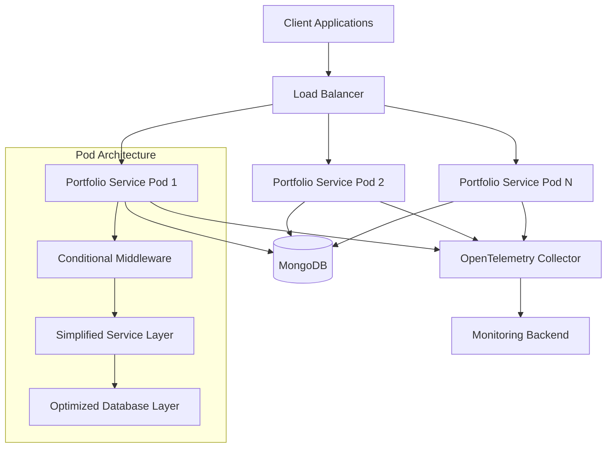
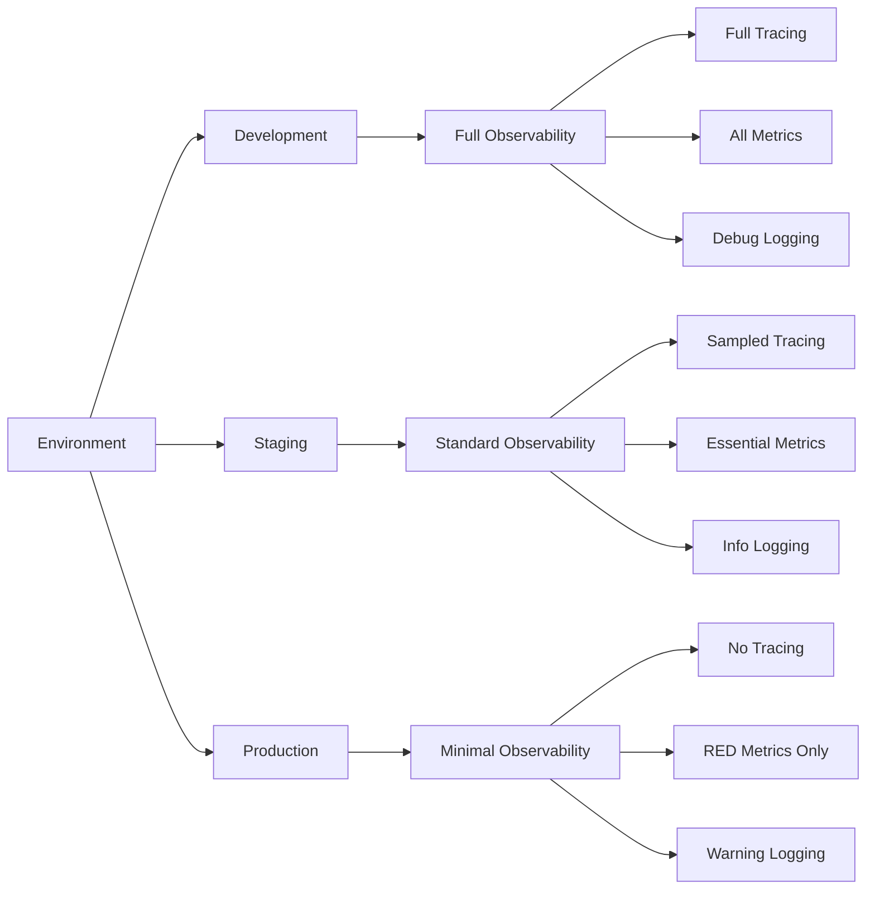

# Design Document: Portfolio Service Streamlining

## Overview

This design transforms the over-engineered Portfolio Service into a lean, high-performance microservice by implementing environment-based configuration, unified OpenTelemetry monitoring, and optimized request processing. The solution maintains API compatibility while achieving 25x performance improvement for bulk operations.

## Architecture

### High-Level Architecture



### Environment-Based Configuration



## Components and Interfaces

### 1. Configuration System

#### Environment Profiles
```python
@dataclass
class EnvironmentProfile:
    log_level: str
    enable_tracing: bool
    enable_metrics: bool
    monitoring_mode: MonitoringMode
    resource_limits: ResourceLimits
    middleware_config: MiddlewareConfig
```

#### Configuration Manager
- **Purpose**: Centralized configuration management with environment-specific profiles
- **Key Features**:
  - Runtime configuration updates
  - Feature flag support
  - Environment detection and profile loading
  - Validation and defaults

### 2. Conditional Middleware System

#### Middleware Factory
```python
class MiddlewareFactory:
    def create_middleware_stack(self, profile: EnvironmentProfile) -> List[Middleware]:
        """Create environment-appropriate middleware stack"""
```

#### Middleware Components
- **Essential Middleware** (Always Active):
  - CORS handling
  - Security headers
  - Request ID generation
  - Basic error handling

- **Conditional Middleware** (Environment-Based):
  - Enhanced HTTP metrics collection
  - Thread monitoring
  - Request/response logging
  - Performance profiling

### 3. Unified Monitoring System

#### Complete Prometheus Removal
The design completely eliminates Prometheus metrics collection and endpoints:
- **Remove**: All Prometheus metric collectors and registries
- **Remove**: `/metrics` endpoint for Prometheus scraping
- **Remove**: Prometheus client libraries and dependencies
- **Remove**: Prometheus-specific middleware and instrumentation

#### OpenTelemetry-Only Integration
```python
class UnifiedMonitoring:
    def __init__(self, config: MonitoringConfig):
        self.tracer = self._setup_tracer(config)
        self.meter = self._setup_meter(config)
        self.otlp_exporter = self._setup_otlp_exporter(config)
        # Note: No Prometheus components
```

#### Monitoring Components
- **Metrics Collection**: RED metrics (Rate, Errors, Duration) via OpenTelemetry OTLP only
- **OTLP Export**: Direct export to OpenTelemetry collector via hostport (localhost:4317)
- **Trace Sampling**: Configurable sampling rates (1-10% in production)
- **Async Export**: Background processing to OpenTelemetry collector
- **Circuit Breaker**: Fallback when OTLP collector is unavailable
- **No Prometheus**: Complete removal of Prometheus metrics infrastructure

### 4. Optimized Service Layer

#### Fast-Path Processing
```python
class OptimizedPortfolioService:
    async def create_portfolios_bulk_fast(self, portfolios: List[PortfolioDTO]) -> List[Portfolio]:
        """Ultra-fast bulk creation with minimal overhead"""
```

#### Service Components
- **Validation Cache**: LRU cache for repeated validation operations
- **Bulk Optimization**: Direct database operations for bulk processing
- **Connection Pooling**: Optimized MongoDB connection management
- **Error Handling**: Simplified retry logic with circuit breaker

### 5. Database Layer Optimization

#### Connection Management
```python
class OptimizedDatabase:
    def __init__(self):
        self.client = self._create_optimized_client()
        self.connection_pool = self._setup_connection_pool()
```

#### Database Features
- **Connection Pooling**: Optimized pool size and timeout settings
- **Bulk Operations**: Native `insert_many` with batch processing
- **Query Optimization**: Indexed queries and efficient pagination
- **Health Monitoring**: Connection health checks and automatic recovery

## Data Models

### Configuration Models

```python
class MonitoringConfig(BaseModel):
    mode: MonitoringMode = MonitoringMode.MINIMAL
    sample_rate: float = Field(default=0.1, ge=0.0, le=1.0)
    export_interval: int = Field(default=60, ge=10, le=300)
    otlp_endpoint: str = "http://localhost:4317"
    enable_metrics: bool = True
    enable_tracing: bool = False

class ResourceLimits(BaseModel):
    memory_request: str = "128Mi"
    memory_limit: str = "256Mi"
    cpu_request: str = "100m"
    cpu_limit: str = "200m"

class MiddlewareConfig(BaseModel):
    enable_request_logging: bool = False
    enable_metrics_middleware: bool = False
    enable_thread_monitoring: bool = False
    enable_performance_profiling: bool = False
```

### Performance Models

```python
class PerformanceMetrics(BaseModel):
    request_duration: float
    memory_usage: int
    cpu_usage: float
    database_operations: int
    cache_hits: int
    cache_misses: int

class BulkOperationResult(BaseModel):
    portfolios_created: int
    duration_ms: float
    errors: List[str]
    performance_metrics: PerformanceMetrics
```

## Error Handling

### Error Categories

1. **Validation Errors**
   - Input validation failures
   - Business rule violations
   - Data consistency errors

2. **System Errors**
   - Database connection failures
   - External service timeouts
   - Resource exhaustion

3. **Performance Errors**
   - Operation timeouts
   - Memory limits exceeded
   - Rate limiting triggered

### Error Handling Strategy

```python
class ErrorHandler:
    def handle_validation_error(self, error: ValidationError) -> HTTPException:
        """Fast-fail for validation errors"""
    
    def handle_system_error(self, error: SystemError) -> HTTPException:
        """Graceful degradation for system errors"""
    
    def handle_performance_error(self, error: PerformanceError) -> HTTPException:
        """Circuit breaker for performance issues"""
```

### Circuit Breaker Implementation

```python
class CircuitBreaker:
    def __init__(self, failure_threshold: int = 5, timeout: int = 60):
        self.failure_threshold = failure_threshold
        self.timeout = timeout
        self.failure_count = 0
        self.last_failure_time = None
        self.state = CircuitState.CLOSED
```

## Testing Strategy

### Performance Testing

#### Load Testing Scenarios
1. **Bulk Operations**: 10, 50, 100 portfolios per request
2. **Concurrent Users**: 1, 10, 50, 100 simultaneous users
3. **Sustained Load**: 1000 requests over 10 minutes
4. **Spike Testing**: Sudden load increases

#### Performance Benchmarks
```python
class PerformanceBenchmarks:
    BULK_10_PORTFOLIOS_MAX_MS = 200
    SINGLE_PORTFOLIO_MAX_MS = 50
    MEMORY_LIMIT_MB = 256
    CPU_LIMIT_MILLICORES = 200
```

### Integration Testing

#### Test Categories
1. **API Compatibility**: Ensure all existing endpoints work
2. **Environment Switching**: Validate configuration changes
3. **Monitoring Integration**: Verify OpenTelemetry export
4. **Database Operations**: Test connection pooling and bulk operations

#### Test Implementation
```python
class IntegrationTests:
    async def test_bulk_performance(self):
        """Verify bulk operations meet performance targets"""
    
    async def test_monitoring_export(self):
        """Verify OpenTelemetry metrics export"""
    
    async def test_environment_profiles(self):
        """Verify environment-based configuration"""
```

### Monitoring and Observability Testing

#### Observability Validation
1. **Metrics Export**: Verify OTLP metrics reach collector
2. **Trace Sampling**: Validate sampling rates and data quality
3. **Log Correlation**: Ensure correlation IDs work across requests
4. **Health Checks**: Validate readiness and liveness probes

## Implementation Phases

### Phase 1: Foundation (Week 1)
- Environment-based configuration system
- Conditional middleware loading
- Basic OpenTelemetry integration
- Performance baseline establishment

### Phase 2: Optimization (Week 2)
- Database connection pooling optimization
- Bulk operation fast-path implementation
- **Complete Prometheus removal** (metrics, endpoints, dependencies, middleware)
- **OpenTelemetry-only implementation** with OTLP export to localhost:4317
- Async metrics export implementation

### Phase 3: Advanced Features (Week 3)
- Circuit breaker implementation
- Validation caching
- Advanced sampling strategies
- Container and Kubernetes optimization

### Phase 4: Production Readiness (Week 4)
- Comprehensive testing and validation
- Performance tuning and optimization
- Documentation and operational procedures
- Production deployment and monitoring

## Deployment Architecture

### Kubernetes Configuration

```yaml
# Optimized deployment configuration
resources:
  requests:
    memory: "128Mi"
    cpu: "100m"
  limits:
    memory: "256Mi"
    cpu: "200m"

# Auto-scaling configuration
hpa:
  minReplicas: 2
  maxReplicas: 10
  targetCPUUtilization: 70
  targetMemoryUtilization: 80
```

### OpenTelemetry Collector Integration

```yaml
# OTLP exporter configuration (Prometheus completely removed)
otlp:
  endpoint: "http://localhost:4317"  # Hostport routing to node-local collector
  protocol: "grpc"
  compression: "gzip"
  timeout: "5s"
  retry_on_failure:
    enabled: true
    initial_interval: "1s"
    max_interval: "30s"

# Prometheus removal checklist:
# - Remove /metrics endpoint
# - Remove prometheus_client dependency
# - Remove all Prometheus metric collectors
# - Remove Prometheus middleware
# - Remove Prometheus configuration
```

## Security Considerations

### Input Validation
- Strict input validation with caching
- Request size limits and rate limiting
- SQL injection prevention (NoSQL context)

### Monitoring Security
- Secure OpenTelemetry collector communication
- Sensitive data filtering in logs and traces
- Access control for monitoring endpoints

### Container Security
- Distroless base images
- Non-root user execution
- Minimal attack surface

## Performance Targets

### Response Time Targets
- Bulk operations (10 portfolios): <200ms (25x improvement)
- Individual operations: <50ms
- Health checks: <10ms

### Resource Targets
- Memory usage: <256MB per pod (50% reduction)
- CPU usage: <200m per pod (60% reduction)
- Database connections: <20 per pod

### Throughput Targets
- Concurrent requests: 100+ per pod
- Bulk operations: 500+ portfolios/second
- Database operations: 1000+ ops/second

This design provides a comprehensive blueprint for transforming the Portfolio Service into a lean, high-performance microservice while maintaining essential functionality and observability through unified OpenTelemetry monitoring.