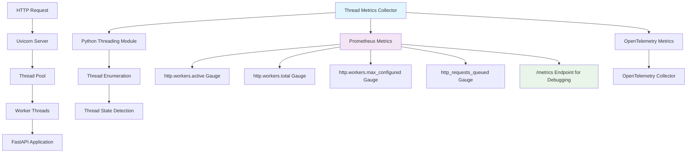

# Thread Metrics Enhancement Design

## Overview

This design document outlines the implementation of thread worker metrics for the GlobeCo Portfolio Service. The solution will add four thread-related metrics (`http.workers.active`, `http.workers.total`, `http.workers.max_configured`, `http_requests_queued`) using the existing Prometheus client library and monitoring infrastructure.

The design leverages the existing monitoring scaffolding in `app/monitoring.py` to avoid breaking current metrics or pipelines, while providing essential visibility into thread pool utilization and request queuing behavior.

## Architecture

### High-Level Architecture



### Component Integration

The thread metrics will integrate with the existing service architecture:

1. **Monitoring Module**: Extend `app/monitoring.py` with thread metrics collection functions
2. **Metrics Collection**: Use existing Prometheus client library and OpenTelemetry metrics
3. **Export Mechanism**: Feed metrics to OpenTelemetry Collector (with `/metrics` endpoint for debugging)
4. **Configuration**: Integrate with existing settings system for enable/disable control

## Components and Interfaces

### 1. Thread Metrics Collection System

#### Core Thread Metrics
```python
# Thread worker metrics (Prometheus gauges for /metrics endpoint)
HTTP_WORKERS_ACTIVE = _get_or_create_metric(
    Gauge,
    'http_workers_active',
    'Number of threads currently executing requests or performing work'
)

HTTP_WORKERS_TOTAL = _get_or_create_metric(
    Gauge,
    'http_workers_total', 
    'Total number of threads currently alive in the thread pool'
)

HTTP_WORKERS_MAX_CONFIGURED = _get_or_create_metric(
    Gauge,
    'http_workers_max_configured',
    'Maximum number of threads that can be created in the thread pool'
)

HTTP_REQUESTS_QUEUED = _get_or_create_metric(
    Gauge,
    'http_requests_queued',
    'Number of pending requests waiting in the queue for thread assignment'
)

# OpenTelemetry thread metrics (for collector export)
try:
    meter = metrics.get_meter(__name__)
    
    otel_http_workers_active = meter.create_up_down_counter(
        name="http_workers_active",
        description="Number of threads currently executing requests or performing work",
        unit="1"
    )
    
    otel_http_workers_total = meter.create_up_down_counter(
        name="http_workers_total",
        description="Total number of threads currently alive in the thread pool",
        unit="1"
    )
    
    otel_http_workers_max_configured = meter.create_up_down_counter(
        name="http_workers_max_configured", 
        description="Maximum number of threads that can be created in the thread pool",
        unit="1"
    )
    
    otel_http_requests_queued = meter.create_up_down_counter(
        name="http_requests_queued",
        description="Number of pending requests waiting in the queue for thread assignment", 
        unit="1"
    )
    
    logger.info("Successfully created OpenTelemetry thread metrics")
    
except Exception as e:
    logger.error("Failed to create OpenTelemetry thread metrics", error=str(e))
    # Create dummy metrics as fallback (following existing pattern)
```

**Design Decisions**:
- **Dual metrics system**: Both Prometheus (for debugging via `/metrics`) and OpenTelemetry (for collector export)
- **Gauge/UpDownCounter metrics**: Thread counts and queue depths are instantaneous values that can go up or down
- **Existing registry**: Uses the proven `_get_or_create_metric()` pattern for duplicate prevention
- **Consistent naming**: Follows existing metric naming conventions with descriptive names

#### Thread Detection and Counting Functions
```python
def get_active_worker_count() -> int:
    """
    Count threads currently executing requests or performing work.
    
    Returns the number of threads with status "RUNNING" or "BUSY" that are
    actively processing HTTP requests or business logic.
    """

def get_total_worker_count() -> int:
    """
    Count total number of threads currently alive in the thread pool.
    
    Returns all threads regardless of state (idle, busy, waiting, blocked).
    """

def get_max_configured_workers() -> int:
    """
    Get the maximum number of threads configured for the thread pool.
    
    Returns the static configuration value for maximum thread pool size.
    """

def get_queued_requests_count() -> int:
    """
    Count pending requests waiting for thread assignment.
    
    Returns the number of requests that have been accepted but are waiting
    for an available thread to process them.
    """
```

### 2. Thread State Detection Logic

#### Python Threading Integration
```python
import threading
import asyncio
from concurrent.futures import ThreadPoolExecutor

def _enumerate_active_threads() -> List[threading.Thread]:
    """Enumerate all active threads in the current process."""
    try:
        return list(threading.enumerate())
    except Exception as e:
        logger.error("Failed to enumerate threads", error=str(e))
        return []

def _is_worker_thread(thread: threading.Thread) -> bool:
    """
    Determine if a thread is a worker thread processing HTTP requests.
    
    Identifies threads based on:
    - Thread name patterns (uvicorn, asyncio, worker)
    - Thread daemon status
    - Thread target function
    """

def _is_thread_active(thread: threading.Thread) -> bool:
    """
    Determine if a worker thread is actively processing work.
    
    Checks thread state and activity indicators to distinguish between:
    - Active threads processing requests
    - Idle threads waiting for work
    """
```

#### Uvicorn/FastAPI Thread Pool Detection
```python
def _detect_uvicorn_thread_pool() -> Dict[str, Any]:
    """
    Detect Uvicorn's thread pool configuration and current state.
    
    Returns information about:
    - Current thread pool size
    - Maximum configured threads
    - Thread pool executor state
    """

def _get_asyncio_thread_pool_info() -> Dict[str, Any]:
    """
    Get information about asyncio's default thread pool executor.
    
    FastAPI/Uvicorn uses asyncio's thread pool for blocking operations.
    """
```

### 3. Request Queue Detection

#### Queue Depth Measurement
```python
def _detect_request_queue_depth() -> int:
    """
    Detect the number of requests waiting for thread assignment.
    
    Approaches to try (in order of preference):
    1. Uvicorn server queue inspection
    2. AsyncIO task queue analysis  
    3. System-level connection queue detection
    4. Proxy metrics from existing HTTP metrics
    """

def _estimate_queue_from_metrics() -> int:
    """
    Estimate queue depth from existing HTTP metrics.
    
    Uses the relationship between:
    - Requests in flight (currently processing)
    - Active worker threads
    - Recent request rate
    """
```

### 4. Metrics Update System

#### Periodic Collection
```python
class ThreadMetricsCollector:
    """
    Collector that updates thread metrics on demand.
    
    Integrates with Prometheus client's collection mechanism to update
    thread metrics whenever the /metrics endpoint is scraped.
    """
    
    def __init__(self):
        self.last_update = 0
        self.update_interval = 1.0  # Update at most once per second
        
    def collect(self):
        """
        Collect and update all thread metrics.
        
        Called by Prometheus client during metrics export.
        """
        current_time = time.time()
        if current_time - self.last_update < self.update_interval:
            return  # Skip update if too recent
            
        try:
            # Update all thread metrics (both Prometheus and OpenTelemetry)
            self._update_worker_metrics()
            self._update_queue_metrics()
            self.last_update = current_time
            
        except Exception as e:
            logger.error("Failed to update thread metrics", error=str(e))
    
    def _update_worker_metrics(self):
        """Update worker thread count metrics for both systems."""
        active_count = get_active_worker_count()
        total_count = get_total_worker_count()
        max_configured = get_max_configured_workers()
        
        # Update Prometheus metrics (for /metrics endpoint)
        HTTP_WORKERS_ACTIVE.set(active_count)
        HTTP_WORKERS_TOTAL.set(total_count)
        HTTP_WORKERS_MAX_CONFIGURED.set(max_configured)
        
        # Update OpenTelemetry metrics (for collector export)
        try:
            otel_http_workers_active.add(active_count - otel_http_workers_active._current_value)
            otel_http_workers_total.add(total_count - otel_http_workers_total._current_value)
            otel_http_workers_max_configured.add(max_configured - otel_http_workers_max_configured._current_value)
        except Exception as e:
            logger.error("Failed to update OpenTelemetry worker metrics", error=str(e))
        
    def _update_queue_metrics(self):
        """Update request queue depth metrics for both systems."""
        queued_count = get_queued_requests_count()
        
        # Update Prometheus metrics (for /metrics endpoint)
        HTTP_REQUESTS_QUEUED.set(queued_count)
        
        # Update OpenTelemetry metrics (for collector export)
        try:
            otel_http_requests_queued.add(queued_count - otel_http_requests_queued._current_value)
        except Exception as e:
            logger.error("Failed to update OpenTelemetry queue metrics", error=str(e))
```

#### Integration with Existing Metrics System
```python
# Register the collector with Prometheus
thread_metrics_collector = ThreadMetricsCollector()

# Add to existing metrics collection in monitoring.py
def setup_thread_metrics():
    """
    Setup thread metrics collection.
    
    Integrates with existing monitoring infrastructure.
    """
    if not settings.enable_metrics:
        logger.info("Thread metrics disabled via configuration")
        return
        
    # Register collector to update metrics on scrape
    from prometheus_client import REGISTRY
    REGISTRY.register(thread_metrics_collector)
    
    logger.info("Thread metrics collection enabled")
```

## Data Models

### Thread Metrics Output Format

#### Prometheus Metrics Format
```
# HELP http_workers_active Number of threads currently executing requests or performing work
# TYPE http_workers_active gauge
http_workers_active 3

# HELP http_workers_total Total number of threads currently alive in the thread pool  
# TYPE http_workers_total gauge
http_workers_total 8

# HELP http_workers_max_configured Maximum number of threads that can be created in the thread pool
# TYPE http_workers_max_configured gauge
http_workers_max_configured 10

# HELP http_requests_queued Number of pending requests waiting in the queue for thread assignment
# TYPE http_requests_queued gauge
http_requests_queued 2
```

### Thread State Classification

| Thread State | Active Count | Total Count | Description |
|--------------|--------------|-------------|-------------|
| Processing HTTP Request | ✓ | ✓ | Thread executing FastAPI endpoint |
| Running Business Logic | ✓ | ✓ | Thread performing database operations |
| Waiting for Work | ✗ | ✓ | Idle thread in pool waiting for assignment |
| Blocked on I/O | ✓ | ✓ | Thread waiting for external resource |
| Starting Up | ✗ | ✓ | Thread being initialized |
| Shutting Down | ✗ | ✓ | Thread being terminated |

### Configuration Integration

#### Settings Extension
```python
class Settings(BaseSettings):
    # Existing settings...
    
    # Thread metrics configuration
    enable_thread_metrics: bool = Field(default=True, description="Enable thread worker metrics")
    thread_metrics_update_interval: float = Field(default=1.0, description="Thread metrics update interval in seconds")
    thread_metrics_debug_logging: bool = Field(default=False, description="Enable debug logging for thread metrics")
```

## Error Handling

### Comprehensive Error Strategy

#### 1. Thread Enumeration Errors
```python
def get_active_worker_count() -> int:
    try:
        threads = threading.enumerate()
        active_count = sum(1 for t in threads if _is_worker_thread(t) and _is_thread_active(t))
        return active_count
    except Exception as e:
        logger.error("Failed to count active worker threads", error=str(e))
        return 0  # Safe fallback
```

#### 2. Thread State Detection Errors
```python
def _is_thread_active(thread: threading.Thread) -> bool:
    try:
        # Multiple approaches to detect activity
        if hasattr(thread, '_target') and thread._target:
            return True  # Thread has active target
        # Additional detection logic...
        return False
    except Exception as e:
        logger.debug("Error detecting thread activity", thread_name=thread.name, error=str(e))
        return False  # Conservative fallback
```

#### 3. Queue Detection Fallbacks
```python
def get_queued_requests_count() -> int:
    # Try multiple approaches in order of reliability
    for approach in [_detect_uvicorn_queue, _detect_asyncio_queue, _estimate_from_metrics]:
        try:
            result = approach()
            if result is not None:
                return result
        except Exception as e:
            logger.debug(f"Queue detection approach {approach.__name__} failed", error=str(e))
    
    return 0  # Safe fallback
```

### Fallback Mechanisms

1. **Thread Count Fallback**: Return 0 for counts if enumeration fails
2. **Queue Depth Fallback**: Return 0 if queue detection fails
3. **Configuration Fallback**: Use reasonable defaults for max configured threads
4. **Metrics Recording**: Use dummy metrics if registration fails (existing pattern)

## Testing Strategy

### Unit Testing Approach

#### 1. Thread Detection Tests
```python
def test_thread_enumeration():
    """Test that thread enumeration works correctly."""
    threads = threading.enumerate()
    assert len(threads) > 0
    assert threading.current_thread() in threads

def test_worker_thread_identification():
    """Test identification of worker threads vs system threads."""
    # Create mock threads with different characteristics
    # Test _is_worker_thread() logic

def test_active_thread_detection():
    """Test detection of active vs idle threads."""
    # Test _is_thread_active() with various thread states
```

#### 2. Metrics Collection Tests
```python
def test_thread_metrics_collection():
    """Test that thread metrics are collected correctly."""
    collector = ThreadMetricsCollector()
    collector.collect()
    
    # Verify metrics were updated
    assert HTTP_WORKERS_ACTIVE._value._value >= 0
    assert HTTP_WORKERS_TOTAL._value._value >= 0

def test_metrics_update_throttling():
    """Test that metrics updates are throttled appropriately."""
    collector = ThreadMetricsCollector()
    
    # Rapid successive calls should be throttled
    collector.collect()
    first_update = collector.last_update
    
    collector.collect()  # Should be skipped
    assert collector.last_update == first_update
```

#### 3. Error Handling Tests
```python
def test_thread_enumeration_error_handling():
    """Test graceful handling of thread enumeration errors."""
    with patch('threading.enumerate', side_effect=Exception("Test error")):
        count = get_active_worker_count()
        assert count == 0  # Safe fallback

def test_queue_detection_fallback():
    """Test fallback behavior when queue detection fails."""
    # Mock all queue detection methods to fail
    # Verify fallback to safe default
```

### Integration Testing

#### 1. End-to-End Thread Metrics Validation
```python
@pytest.mark.asyncio
async def test_thread_metrics_integration():
    """Test complete thread metrics collection in running service."""
    # Start service with thread metrics enabled
    # Make concurrent requests to create thread activity
    # Verify thread metrics reflect actual thread usage
```

#### 2. Load Testing Validation
```python
def test_thread_metrics_under_load():
    """Test thread metrics accuracy under concurrent load."""
    # Generate high concurrent load
    # Monitor thread metrics during load
    # Verify metrics correlate with actual thread usage
```

## Performance Considerations

### Collection Overhead
- **Thread enumeration**: Lightweight operation, typically <1ms
- **Thread state detection**: Minimal CPU overhead per thread
- **Update throttling**: Prevents excessive collection during high scrape rates
- **Caching**: Results cached for short intervals to reduce repeated work

### Memory Impact
- **Thread references**: No long-term thread references held
- **Metrics storage**: Four additional gauge metrics (minimal memory)
- **Collection state**: Small collector state object

### Scalability
- **Thread count scaling**: Linear performance with thread count
- **Collection frequency**: Configurable update intervals
- **Error resilience**: Graceful degradation under error conditions

## Deployment Considerations

### Single-Process Requirement
The service maintains single-process deployment (uvicorn, not gunicorn with workers):

```dockerfile
# Dockerfile already uses single-process deployment
CMD ["uvicorn", "app.main:app", "--host", "0.0.0.0", "--port", "8000"]
```

**Rationale**: Thread metrics are process-specific. Multiple worker processes would require aggregation across processes.

### Configuration Management
```yaml
# Environment variables
ENABLE_THREAD_METRICS: "true"
THREAD_METRICS_UPDATE_INTERVAL: "1.0"
THREAD_METRICS_DEBUG_LOGGING: "false"
```

### Monitoring Integration
The metrics will be automatically sent to the existing OpenTelemetry Collector via the service's existing OpenTelemetry integration, requiring no changes to Kubernetes manifests or monitoring setup. The `/metrics` endpoint provides the same metrics for debugging purposes.

## Security Considerations

### Information Exposure
- **Thread information**: Only counts exposed, no sensitive thread details
- **System visibility**: Provides insight into service capacity, not internal data
- **Access control**: Uses existing `/metrics` endpoint security patterns

### Resource Protection
- **Collection limits**: Update throttling prevents resource exhaustion
- **Error boundaries**: Failures in thread metrics don't impact request processing
- **Safe defaults**: Conservative fallbacks prevent misleading metrics

## Compatibility and Migration

### Backward Compatibility
- **No breaking changes**: Existing metrics and functionality unchanged
- **Optional feature**: Can be disabled via configuration
- **Additive metrics**: New metrics complement existing HTTP metrics

### Migration Strategy
1. **Phase 1**: Deploy with thread metrics enabled in development
2. **Phase 2**: Enable in staging with monitoring validation
3. **Phase 3**: Production deployment with gradual rollout
4. **Phase 4**: Integration with existing dashboards and alerts

## Implementation Phases

### Phase 1: Core Thread Detection
- Implement basic thread enumeration and counting
- Add thread state detection logic
- Create core metrics with existing registry system

### Phase 2: Queue Detection
- Implement request queue depth detection
- Add fallback mechanisms for queue estimation
- Integrate with existing HTTP metrics for correlation

### Phase 3: Collection System
- Create ThreadMetricsCollector class
- Implement update throttling and caching
- Add comprehensive error handling

### Phase 4: Integration and Testing
- Integrate with existing monitoring infrastructure
- Add configuration options and validation
- Implement comprehensive test suite

This design ensures a robust, maintainable, and performant implementation of thread metrics that integrates seamlessly with the existing GlobeCo Portfolio Service monitoring architecture while providing essential visibility into thread pool utilization and request queuing behavior.